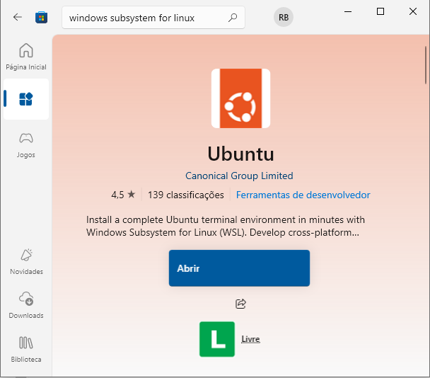
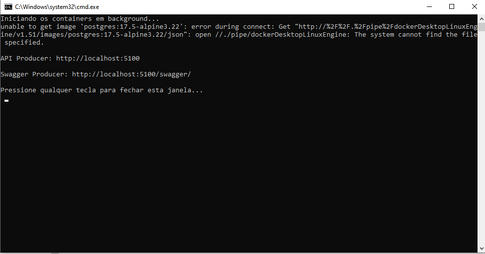
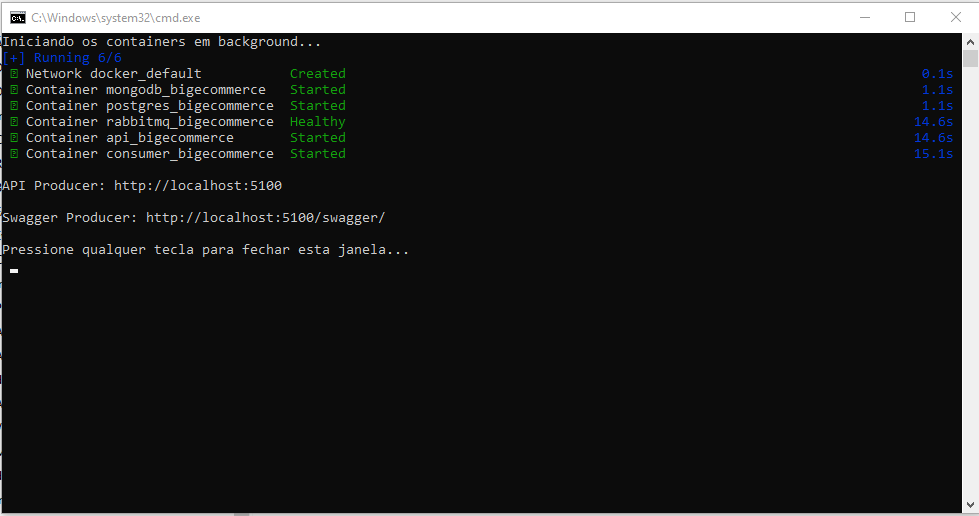
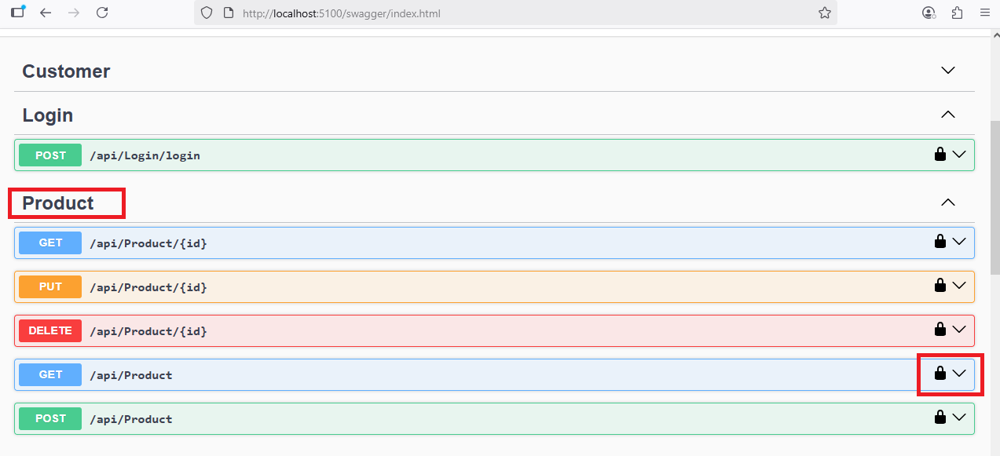
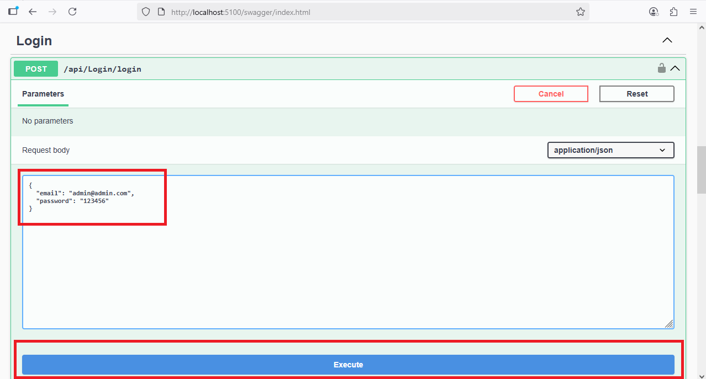
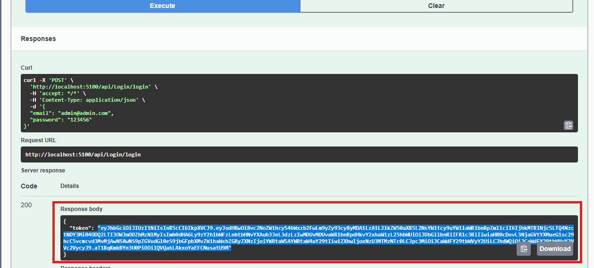
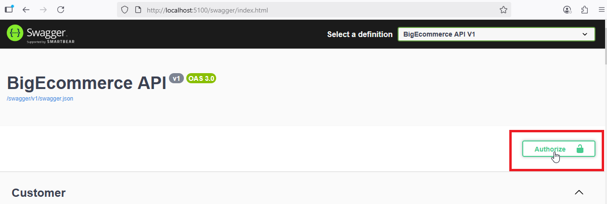
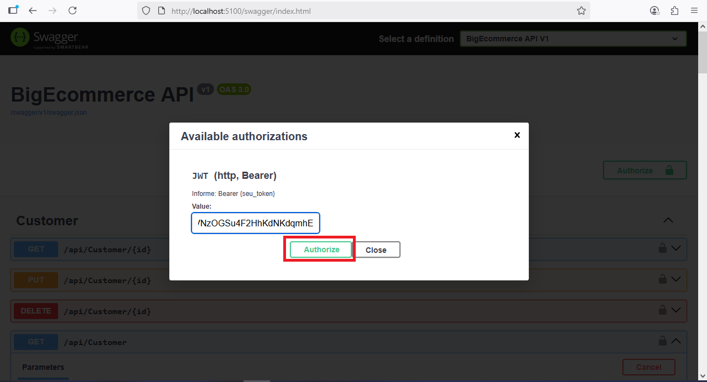
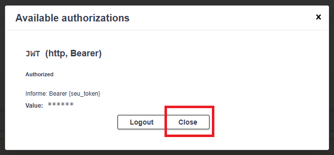

## Opção Escolhida de Fluxo

Foi Escolhido a **Opção A: Fluxo básico** para realizar esse desafio.  

## Guia para Rodar o Aplicativo

Este repositório contém uma aplicação **.NET 8**, preparada para rodar em um ambiente com **Docker** e **WSL2** (se estiver no windows).  

Siga cuidadosamente os passos abaixo para configurar e executar o projeto.

---

## Pré-requisitos para Rodar o projeto

- ter o `Docker` instalado na máquina. Para tal é necessário uma distribuição Linux instalada (se você estiver no Windows).
- Vá em [https://www.docker.com/get-started/](https://www.docker.com/get-started/) e instale o docker, caso ainda não o tenha instalado.

---

## Como instalar o Docker no Windows (caso já instalado, desconsidere)

Instalar Uma Distribuição Linux (caso sua máquina não tenha)

1. Pressione `Win + S` e digite **"Windows subsystem for Linux"**.



2. Clique em **OK** e reinicie o computador quando solicitado.

## Atualizar para o WSL2
- Na pasta `instalador-wsl2`, há um `.msi` baixado de fontes oficiais para facilitar. É só instalar ele.

**ou**
- Na pasta `instalador-wsl2`, rode o `wsl2.bat`.

**ou**

- Vá em [https://aka.ms/wsl2kernel](https://aka.ms/wsl2kernel) e siga os passos

---

# 🧪 Como rodar os testes unitários no Windows

## ✅ Pré-requisitos:

Antes de rodar os testes, é **obrigatório** instalar o .NET SDK 8.0 no seu computador. Sem isso, o arquivo `.bat` não vai funcionar.

### 1. Baixe e instale o .NET SDK 8.0 caso não o tenha

- Acesse o link oficial:  
  👉 [https://dotnet.microsoft.com/en-us/download/dotnet/8.0](https://dotnet.microsoft.com/en-us/download/dotnet/8.0)

- Clique em **".NET SDK 8.0"** (não o Runtime!) e baixe a versão para **Windows x64**.

- Execute o instalador e siga as instruções na tela.

- Após instalar, confirme que deu certo:

  1. Abra o `Prompt de Comando` (CMD)
  2. Digite:
     ```cmd
     dotnet --version
     ```
  3. Ele deve mostrar algo como `8.0.xxx`

---

### 2. Rode o arquivo `.bat` para executar os testes

- Localize o arquivo `run-tests.bat`, na raiz do projeto
- Clique duas vezes nele

Se estiver tudo certo, ele vai abrir o terminal e começar a rodar os testes. Você verá a saída de cada teste diretamente no CMD.

---

## Como Rodar o projeto:

1. Certifique-se de que o **Docker** esteja rodando, Caso contrário você receberá esse erro ao rodar o bat:



2. No **Windows**: dê um duplo clique no arquivo `up.bat`, na pasta **docker**
- Ou, via terminal No **Windows**:
  bash
  cd docker
  up.bat
  
- Ou, se estiver em **Linux ou MacOS**:
  bash
  cd docker
  docker compose up -d
    

- obs: Demora bastante pra terminar e buildar a primeira vez, pois você ainda não tem as imagens dos containers na sua máquina. 

3. Aguarde Até que todos os serviços sejam iniciados corretamente. 

- Ao final do build, seu CMD estará assim:



- Com todos os serviços necessários para rodar a aplicação rodando, abra o Navegador e Acesse o Swagger:

    
    http://localhost:5100/swagger/
      
---

## Observações
- Certifique-se de que o **Docker** esteja rodando antes de executar o `up.dev.bat` ou `up.bat`.  
- Se estiver usando **Linux ou MacOS**, será necessário adaptar os `.bat` para os scripts equivalente `.sh`.

---

## Documentação da API com Swagger

-Este projeto utiliza o Swagger para documentar e testar a API de forma interativa.
O Swagger gera automaticamente uma interface web baseada nos endpoints disponíveis, permitindo que qualquer pessoa visualize as rotas, parâmetros e modelos de dados sem precisar abrir ferramentas externas.

## Usando o Swagger para fazer o fluxo da Opção A do desafio

1. Acesse a interface

-Após rodar a aplicação no docker, abra o navegador e vá até:

    
    http://localhost:5100/swagger/
      
-A página do Swagger será carregada com a lista de endpoints disponíveis agrupadas por área (ex.: Produtos, Vendas, etc..).



2. Autenticação com JWT

- Essa API exige autenticação, será necessário inserir o token JWT.

- Para se obter o token, é necessário localizar o login pelo endpoint Login e colocar as credenciais para o usuário já criado e clicar no botão execute. Ver na imagem as áreas em vermelho, que mostram onde colocar as credenciais e onde está o botão **Executar**, para disparar a request.
    
    email: admin@admin.com</br>
    password: 123456
    



- Para ver o resultado da request, após clicar no botão executar, deve-se rolar a página e copiar o token gerado, que vale por 60 minutos (ver área em vermelho na imagem abaixo).



- Clicar no botão Authorize, no início da página



- Colcar o Token obtido no campo Value e depois no botão Authorize, em vermelho na imagem abaixo:


    
    obs: NÃO COLAR AS ASPAS DO TOKEN
      




- Clicar em **Close**



- Agora, com o usuário autenticado, o próprio swagger se encarrega de manda-lo nas requests.


### 3. Agora que estamos logados, podemos mandar as requests para fazer o Fluxo da Opção A

#### 3.1 – Listar os produtos disponíveis

- No Swagger, expanda a seção **Product**.
- Localize e clique no endpoint **GET /api/Product**.
- Clique em **Try it out** e depois em **Execute**.

Isso trará todos os produtos cadastrados. Anote o campo `id` do produto que você deseja comprar.

#### 3.2 – Listar os usuários disponíveis

- No Swagger, expanda a seção **Customer**.
- Localize e clique no endpoint **GET /api/Customer**.
- Clique em **Try it out** e depois em **Execute**.

Isso trará todos os usuários cadastrados. Anote o campo `id` do usuário que você deseja utilizar para a compra.

#### 3.3 – Criar um pedido (venda)

- No Swagger, expanda a seção **Sales**.
- Localize e clique no endpoint **POST /api/Sales**.
- Clique em **Try it out**.

No corpo da requisição (`Request body`), preencha os campos com as seguintes informações mínimas:

```json
{
  "saleDto": {
    "saleDate": "2025-09-08T21:37:23.048Z",
    "customerId": "ID_DO_CLIENTE",
    "customerName": "NOME_DO_CLIENTE",
    "branchName": "NOME_FILIAL",
    "totalAmount": VALOR_TOTAL_VENDA,
    "items": [
      {
        "productId": "ID_DO_PRODUTO",
        "unitPrice": PRECO_DO_PRODUTO,
        "quantity": QUANTIDADE_DO_PRODUTO,
        "discount": DESCONTO_DO_PRODUTO
      }
    ],
    "discount": DESCONTO_TOTAL
  }
}
```

- Substitua os valores corretos para passar para a API.
- Clique em **Execute**.

Se tudo ocorrer corretamente, a resposta mostrará os dados do pedido criado, incluindo o `ID_DA_VENDA`, que será usado no pagamento.

#### 3.4 – Realizar o pagamento do pedido

- No Swagger, expanda a seção **Payment**.

##### Opção 1: Pagamento com Pix

- Localize e clique no endpoint **POST /api/Payment/pix**.
- Clique em **Try it out**.
- No corpo da requisição, insira o seguinte JSON:

```json
{
  "orderId": "ID_DA_VENDA",
  "amount": VALOR_DA_VENDA
}
```

- Substitua `"ID_DA_VENDA"` pelo ID retornado na criação do pedido.
- Clique em **Execute**.

##### Opção 2: Pagamento com Cartão

- Localize e clique no endpoint **POST /api/Payment/card**.
- Clique em **Try it out**.
- No corpo da requisição, use o seguinte JSON de exemplo:

```json
{
  "orderId": "ID_DA_VENDA",
  "cardNumber": "4111111111111111",
  "cardHolder": "NOME DO TITULAR",
  "expiration": "12/25",
  "cvv": "123",
  "amount": VALOR_DA_VENDA
}
```

- Preencha os dados do cartão (fictício) e clique em **Execute**.

Após isso, o pagamento será processado e o pedido será finalizado.

#### 3.5 – Consultar o histórico do pedido

- No Swagger, expanda a seção **Sales**.
- Localize e clique no endpoint **GET /api/Sales/{id}**.
- Clique em **Try it out**.

- No campo `customerId`, insira o ID do cliente que realizou o pedido.
- Clique em **Execute**.

A resposta mostrará todos os pedidos feitos por esse cliente, com status, itens, valores e informações de pagamento.

Esse endpoint permite acompanhar a evolução e o histórico completo das compras feitas no sistema.


